## PRAKTIKUM 3 BAHASA PEMROGRAMAN

- Latihan 1 Penggunaan End dan Seperator

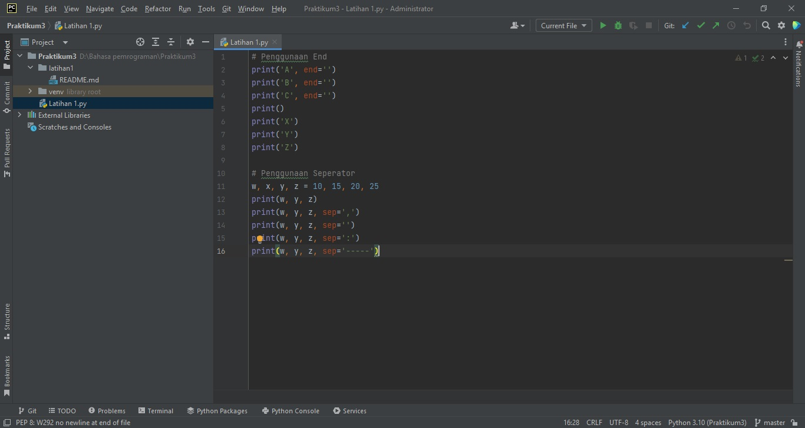
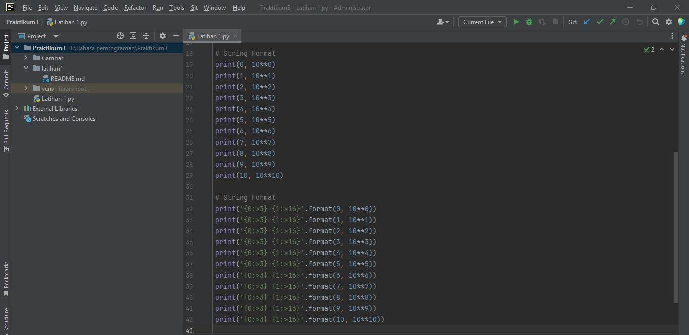
Run 
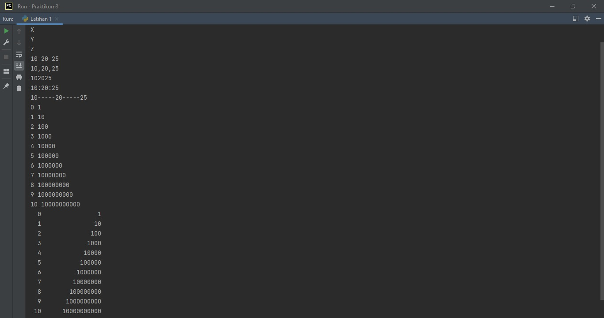

- Latihan 2 Penggabungan, Penjumlahan, Pembagian

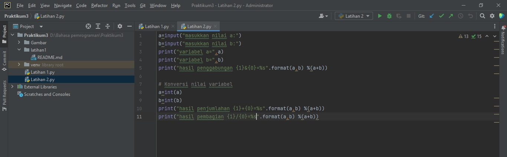
 Run
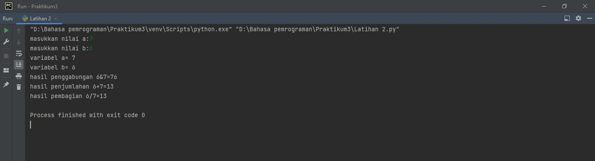

- Latihan 3 Menghitung Luas dan Keliling Lingkaran

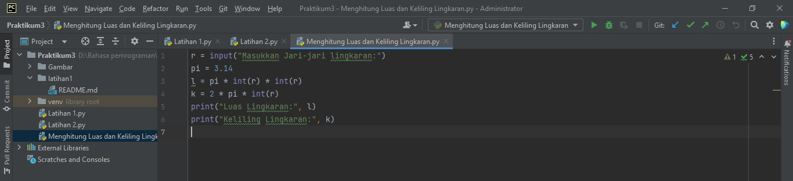
 Run
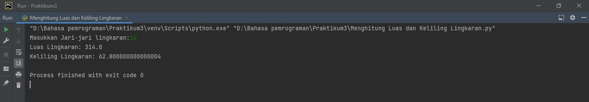

Flowchart

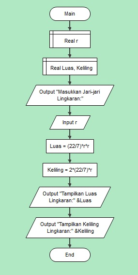

 Penjelasan

> print("Masukkan Jari-jari Lingkaran:")
> 
> r = float(input())
> 
> luas = float(22) / 7 * r * r
> 
> keliling = 2 * (float(22) / 7) * r
> 
> print("Tampilkan Luas Lingkaran:" + str(luas))
> 
> print("Tampilkan Keliling Lingkaran:" + str(keliling))
> 

 Run

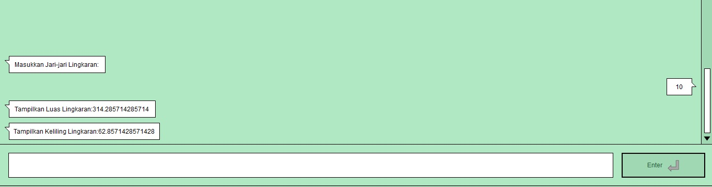

- Latihan membuat Belah Ketupat (Diamond) dengan formatting string

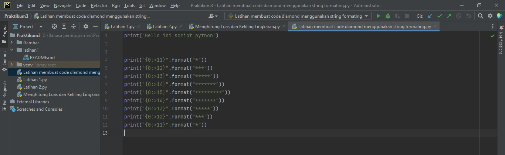

Run

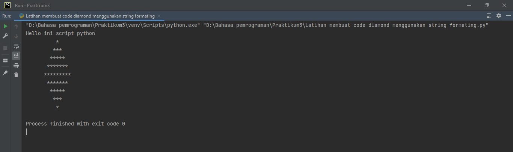
